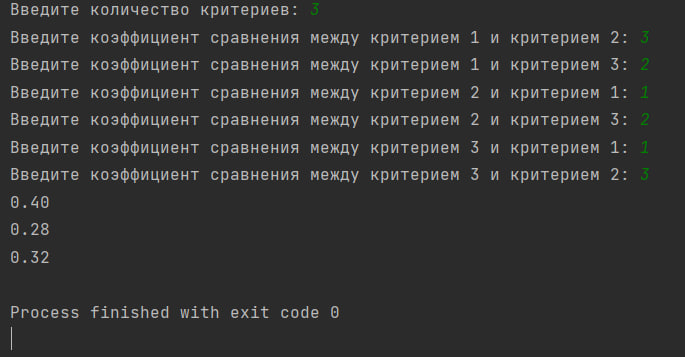
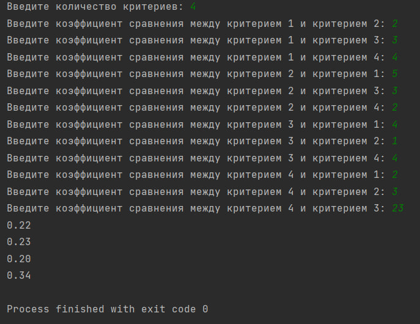

# Lab--6
# Автор программы
Шевцов Михаил Фт-220007
# Функционал программы
Данная программа основана на Методе Анализа Иерархий (МАИ) Саати, на основе входных данных выводит весовые коэффициенты для каждого критерия
# Запуск программы
Программа была написана в PyCharm Edu 2022.2.2, но открыть её можно в абсолютно любой среде программирования. Чтобы воспользоваться программой, вам надо открыть файл с названием “Метод анализа иерархий Томаса Саати Шевцов Фт-220007.py”, начать тест и следовать указаниям программы.
# Тесты
Тест 1
___

___
Тест 2
___

